# 🏔️ Himalaya AI
### Smart Tourism Prediction & AI Travel Planning Platform for Sikkim

Himalaya AI is an intelligent tourism platform that combines Machine Learning, Artificial Intelligence, and Real-Time Weather Data to help travelers make smarter travel decisions in Sikkim.

The platform predicts tourist crowd levels, provides weather-aware travel recommendations, generates AI-powered itineraries, discovers hidden gems, and offers an interactive travel assistant.

---

# ✨ Key Features

## 🤖 AI Travel Assistant
- Powered by Groq Llama 3.3 70B
- Destination-specific travel guidance
- Permit information
- Travel tips and recommendations
- Answers tourism-related questions about Sikkim

---

## 📈 Crowd Forecasting System
Machine Learning powered crowd prediction for tourist destinations.

Predicts:
- 🟢 Low Crowd
- 🟡 Medium Crowd
- 🔴 High Crowd

Uses:
- Month
- Weekend Information
- Holiday Data
- Tourist Destination
- Weather Patterns
- Historical Tourism Trends

Provides:
- Crowd Forecast
- Travel Recommendation
- Travel Tips

---

## 🌦️ Real-Time Weather Integration
Integrated Weather API provides:

- Live Weather Conditions
- Temperature Information
- Weather Forecast Insights
- Weather-aware Travel Suggestions

This improves the accuracy of travel recommendations and planning.

---

## 🗺️ AI Itinerary Generator

Generate personalized travel plans based on:

- Number of Days
- Number of Travelers
- Travel Interests
- Source City
- Travel Date

Features:
- AI Generated Trip Title
- AI Generated Trip Overview
- Day-wise Travel Plan
- Cost Estimation
- Hidden Gem Discovery
- Personalized Travel Tips

---

## 🚗 Smart Route Planner

Users enter their source city and the platform generates:

- Recommended Travel Mode
- Travel Route
- Travel Duration
- Travel Advice

Example:

Delhi → Bagdogra Airport → Gangtok

---

## 💎 Hidden Gem Recommendation System

Recommends lesser-known attractions based on:

- User Interests
- Popularity Score
- Destination Category

Promotes exploration beyond mainstream tourist locations.

---

## 📄 PDF Export

Export generated itineraries into downloadable PDF format.

Includes:
- Trip Overview
- Day-wise Plan
- Cost Summary
- Hidden Gem Recommendation
- Travel Tips

---

# 🛠️ Tech Stack

## Frontend
- React
- TypeScript
- Vite
- Tailwind CSS
- Framer Motion

## Backend
- Flask
- Python

## Machine Learning
- Scikit-Learn
- Random Forest Classifier
- Random Forest Regressor

## AI
- Groq API
- Llama 3.3 70B Versatile

## APIs
- Weather API (Real-Time Weather Integration)

## Database
- SQLite

---

# 📂 Project Structure

Backend/
│
├── controllers/
├── routes/
├── services/
├── ml/
├── models/
├── datasets/
└── app.py

Frontend/
│
├── src/
│ ├── pages/
│ ├── components/
│ ├── services/
│ └── assets/
└── vite.config.ts

---

# 🧠 Machine Learning Modules

### Crowd Prediction Model
Predicts future crowd levels using tourism and weather data.

### Weather Prediction Module
Provides weather-aware recommendations.

### AI Itinerary Generation
Uses Groq LLM to generate personalized travel plans.

---

# 🚀 Future Enhancements

- Multi-State Tourism Support
- User Accounts & Saved Trips
- Flight & Train Integration
- Hotel Recommendation System
- Explainable AI for Crowd Predictions
- Live Event & Festival Recommendations

---

# 📷 Add Screenshots In README

## Home Page

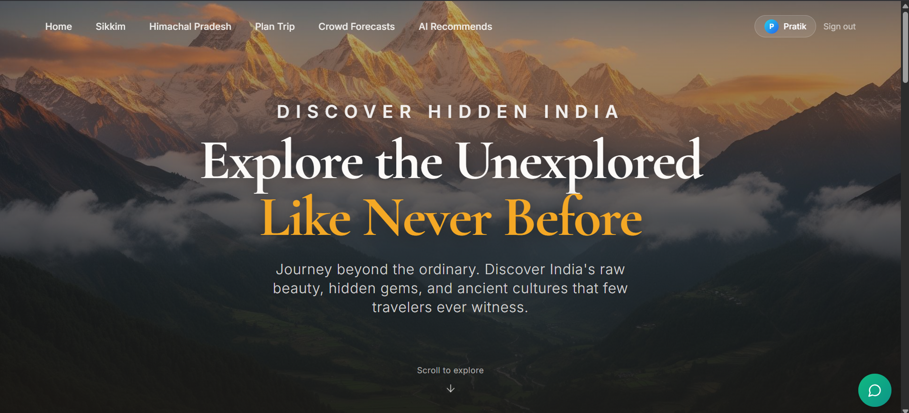
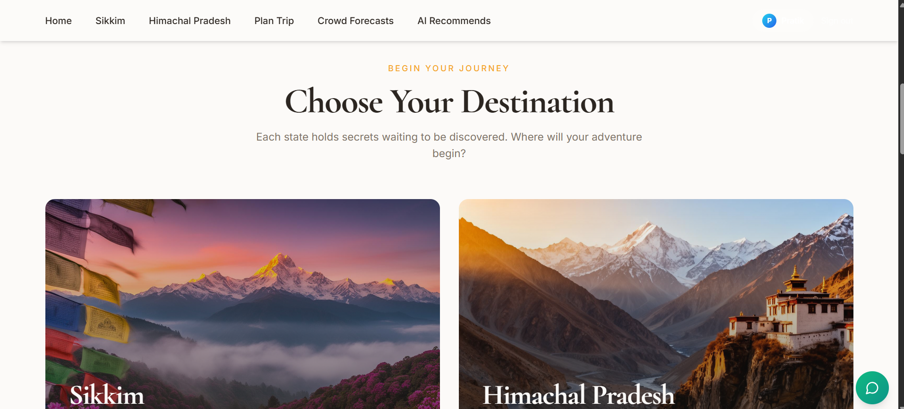

## Crowd Forecast

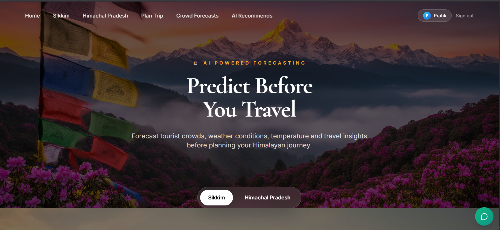
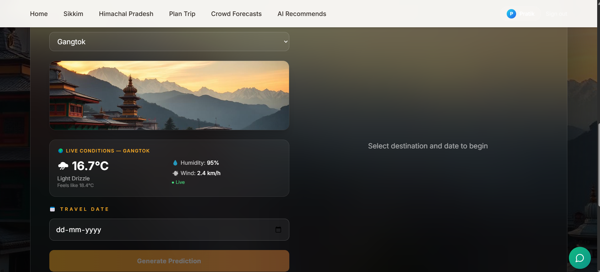
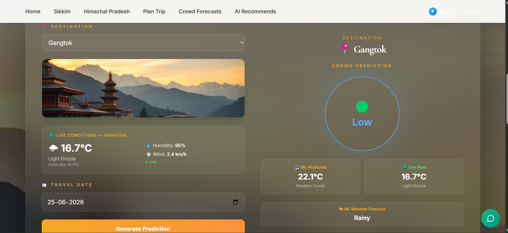
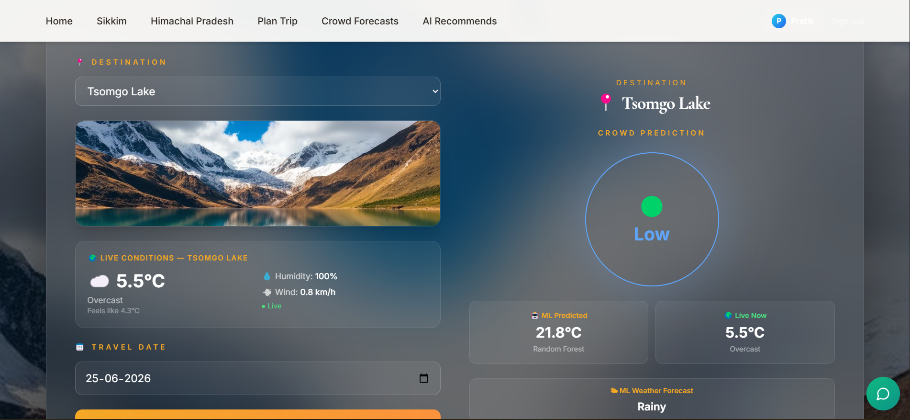

## AI Travel Assistant

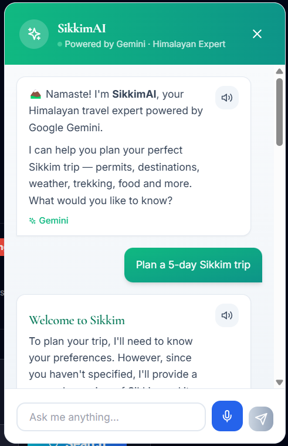

## AI Itinerary Generator

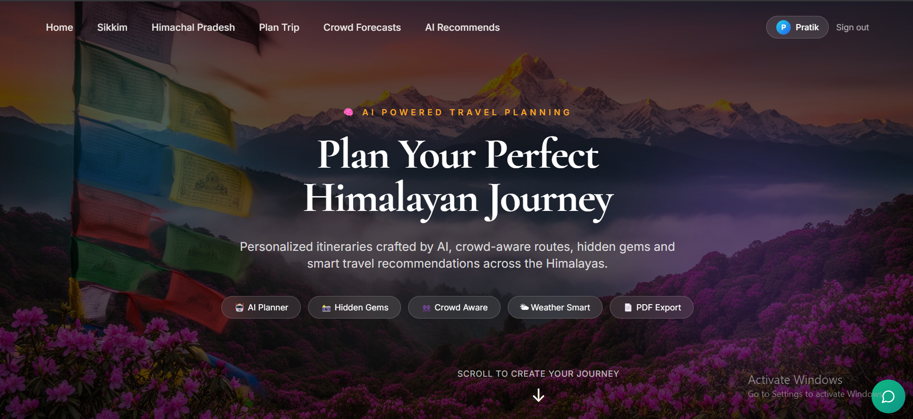
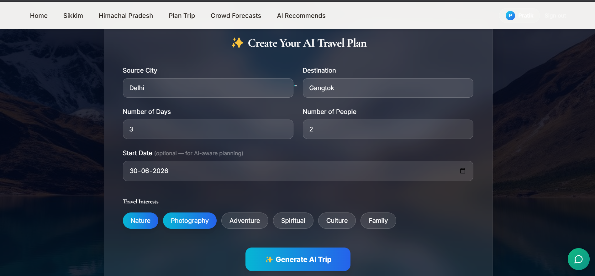

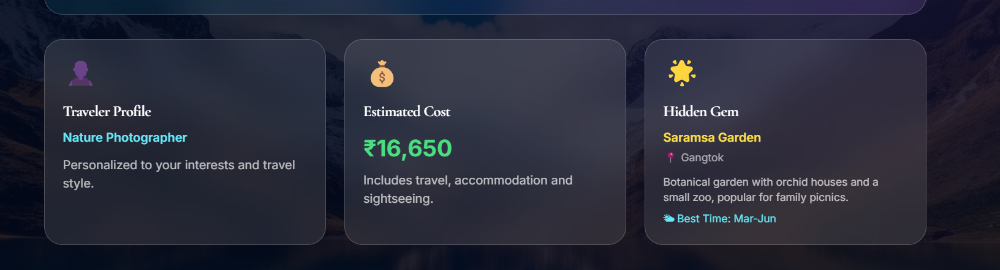
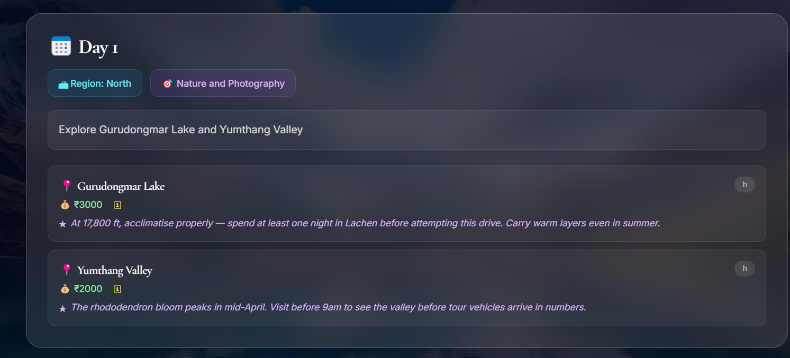
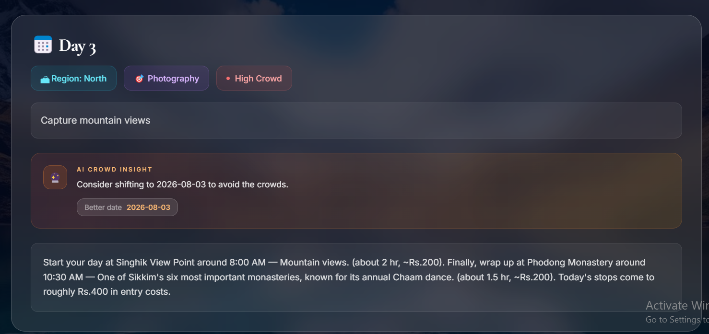
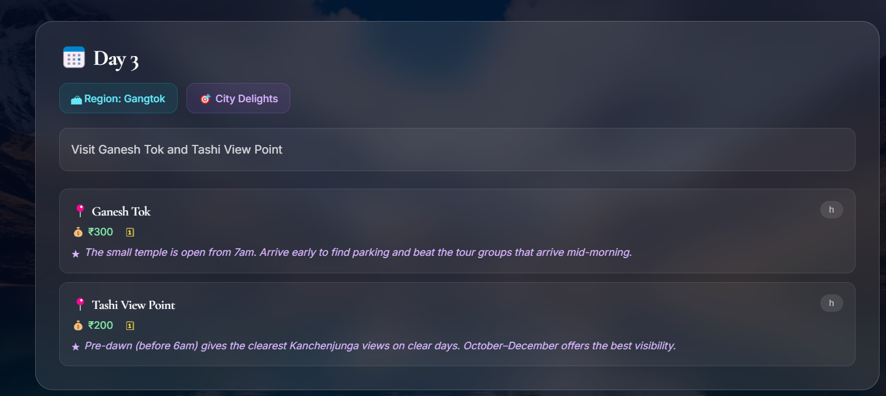
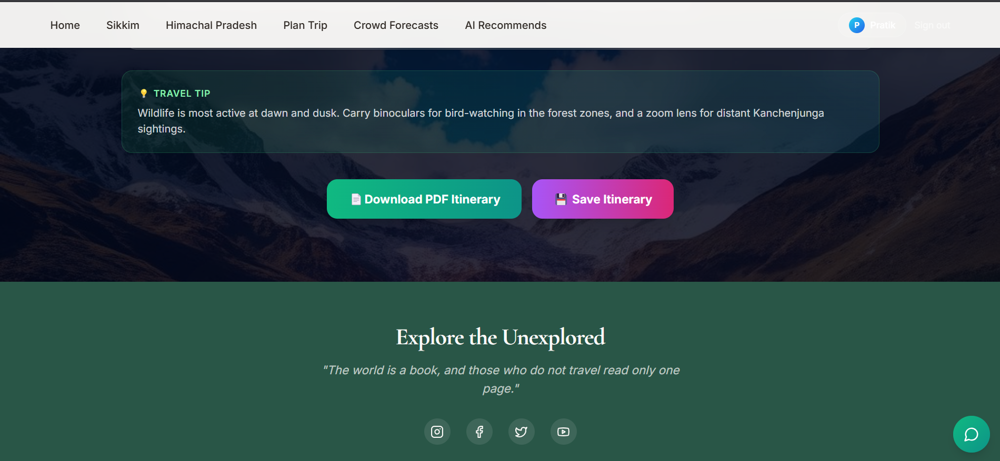

---

# 👨‍💻 Author

Developed as a Full-Stack AI Tourism Platform using Machine Learning, LLMs, Weather APIs, and Modern Web Technologies.

Built for smarter travel planning in the Himalayas.