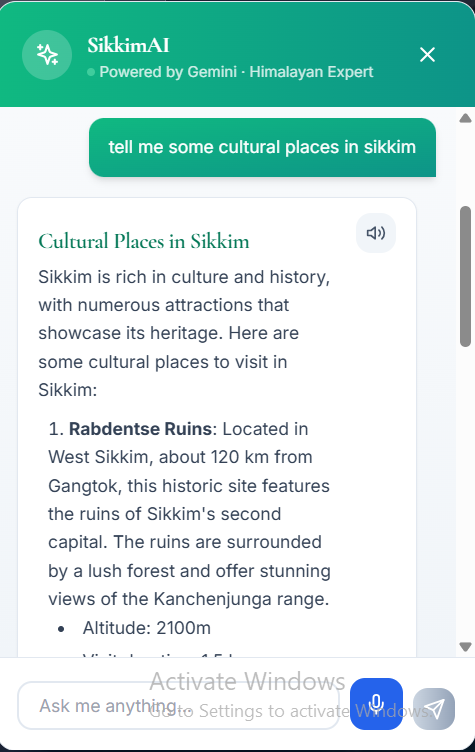
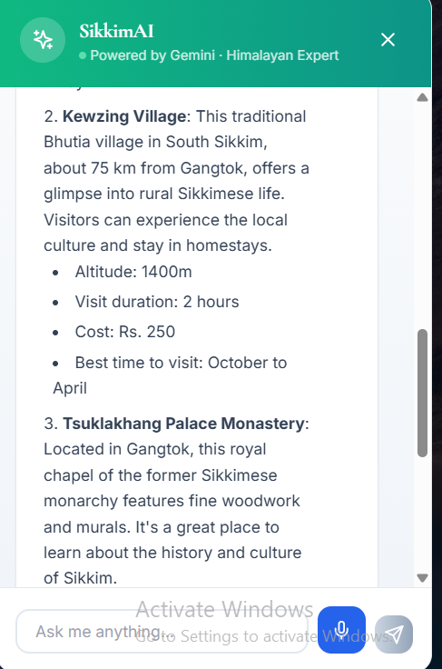
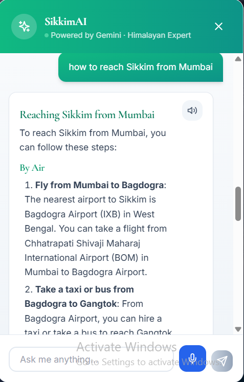
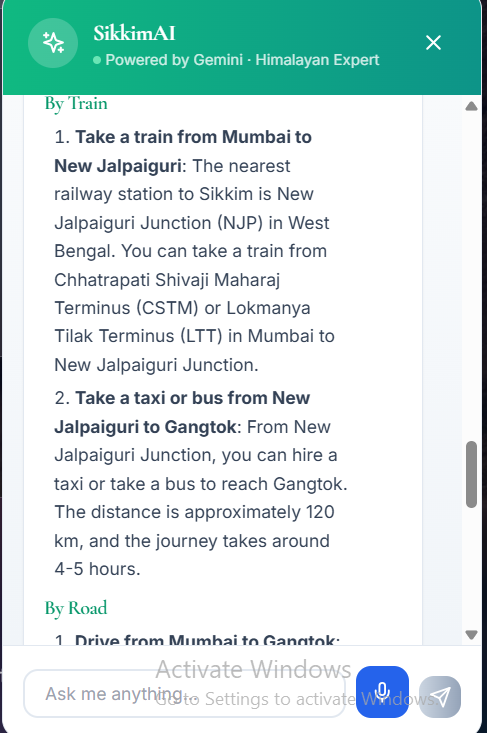
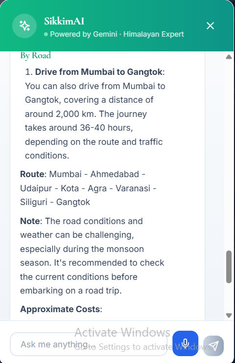
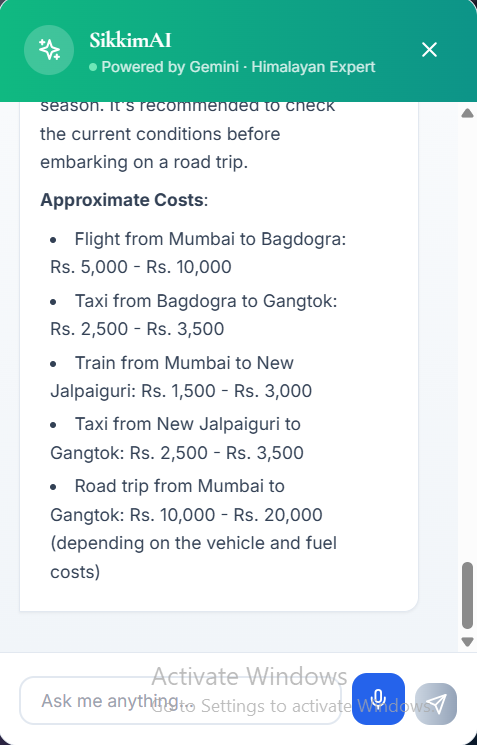

# 🏔️ Himalaya AI
## Smart Tourism Prediction & Agentic AI Travel Planning Platform for Sikkim

Himalaya AI is a full-stack **Agentic AI tourism platform** that helps travelers make smarter travel decisions using **Machine Learning, Retrieval-Augmented Generation (RAG), LangGraph agents, and real-time weather data**.

Instead of providing static travel information, the platform predicts tourist crowd levels, generates AI-powered itineraries, recommends better travel dates, discovers hidden gems, and answers travel questions using a RAG-powered assistant grounded in a vector database of Sikkim attractions.

---

# 🚀 Features

## 🤖 RAG-Powered AI Travel Assistant

- Powered by **Groq Llama 3.3 70B**
- Uses **ChromaDB** for Retrieval-Augmented Generation (RAG)
- Retrieves only the most relevant attractions
- Destination-specific travel guidance
- Permit information
- Travel recommendations
- Local travel tips

---

## 🧭 Agentic AI Itinerary Generator

A multi-step **LangGraph** workflow instead of a single LLM prompt.

```text
Retrieve
   ↓
Draft Itinerary
   ↓
Map Travel Dates
   ↓
Predict Crowd Levels
   ↓
Revise (if needed)
   ↓
Finalize
```

### Workflow

#### 1. Retrieve
- Searches the Chroma vector database
- Retrieves attractions matching traveler interests

#### 2. Draft
- Generates a personalized itinerary
- Creates day-wise travel plans

#### 3. Crowd Check
- Evaluates every travel day using the ML crowd prediction model

#### 4. Revise
If a day is predicted to have **High Crowd**, the agent:
- Searches nearby dates
- Finds a better alternative
- Generates an AI recommendation

#### 5. Finalize
Produces:
- AI Trip Title
- Trip Overview
- Narrative Day Schedule
- Crowd Badges
- Crowd Insights
- Suggested Alternate Dates
- Cost Estimate
- Hidden Gems
- Travel Tips

---

## 🧠 Crowd Advisor Agent

```text
Predict Crowd
      ↓
Explain Prediction
      ↓
Search Nearby Dates
      ↓
Recommend Better Date
```

Features:
- Crowd prediction
- AI explanation
- Nearby date recommendation
- Travel advice

---

## 📈 Crowd Forecasting

Predicts:
- 🟢 Low Crowd
- 🟡 Medium Crowd
- 🔴 High Crowd

Uses:
- Destination
- Month
- Weekend
- Holiday
- Weather
- Historical tourism trends

Provides:
- Crowd Forecast
- Travel Recommendation
- Travel Tips

---

## 🌦️ Real-Time Weather

Powered by **Open-Meteo API**

- Live weather
- Temperature
- Forecast
- Weather-aware travel suggestions

---

## 🚗 Smart Route Planner

Example:

```text
Delhi
   ↓
Bagdogra Airport
   ↓
Gangtok
```

Provides:
- Recommended route
- Travel duration
- Travel mode
- Travel advice

---

## 💎 Hidden Gem Recommendation

Recommends lesser-known attractions based on:
- User interests
- Popularity score
- Destination category

---

## 📄 PDF Export

Exports complete itineraries containing:
- Trip overview
- Day-wise itinerary
- Cost summary
- Hidden gem recommendation
- Travel tips

---

# 🏗️ System Architecture

```text
                    User
                      │
          React + TypeScript Frontend
                      │
                  Flask Backend
                      │
      ┌───────────────┼────────────────┐
      │               │                │
 LangGraph        Crowd ML        Weather API
   Agents          Models         Open-Meteo
      │
      │
 ChromaDB (RAG)
      │
 Groq Llama 3.3
```

---

# 🧠 AI & Machine Learning Modules

## Crowd Prediction
- Random Forest Classifier
- Tourism + weather based crowd prediction

## Weather Module
Provides weather-aware recommendations.

## RAG Retrieval
- Chunks attractions dataset
- Creates embeddings
- Stores vectors in ChromaDB
- Retrieves only relevant context

Dataset:
- 83 Attractions
- Gangtok
- East Sikkim
- South Sikkim
- West Sikkim
- North Sikkim

## Itinerary Agent
```text
Retrieve → Draft → Crowd Check → Revise → Finalize
```

## Crowd Advisor Agent
```text
Predict → Explain → Nearby Date Search → Recommend
```

---

# 🛠️ Tech Stack

## Frontend
- React
- TypeScript
- Vite
- Tailwind CSS
- Framer Motion

## Backend
- Python
- Flask

## Agentic AI
- LangGraph
- LangChain
- Groq API
- Llama 3.3 70B
- ChromaDB

## Machine Learning
- Scikit-Learn
- Random Forest Classifier
- Random Forest Regressor
- SHAP

## APIs
- Open-Meteo API

## Database
- SQLite

---

# 📂 Project Structure

```text
Backend/
├── agents/
│   ├── crowd_advisor/
│   └── itinerary_agent/
├── rag/
│   ├── build_index.py
│   └── retriever.py
├── controllers/
├── routes/
├── services/
├── ml/
├── models/
├── datasets/
└── app.py

Frontend/
├── src/
│   ├── components/
│   ├── pages/
│   ├── services/
│   └── assets/
└── vite.config.ts
```

---

# 📈 Future Enhancements

- Multi-State Tourism Support
- User Accounts & Saved Trips
- Flight & Train Integration
- Hotel Recommendation System
- Explainable AI Dashboard
- Live Event & Festival Recommendations
- Per-attraction crowd prediction

---

# 📷 Screenshots

## 🏠 Home

```md


```

## 📈 Crowd Forecast

```md


```

## 🤖 AI Travel Assistant

```md








```

## 🧭 Agentic AI Itinerary Generator

```md


```

---

# 👨‍💻 Author

**Pratik Pandit**

Full-Stack AI Developer

Built using **LangGraph, Retrieval-Augmented Generation (RAG), Machine Learning, LLMs, Flask, React, TypeScript, and Modern Web Technologies** to enable smarter travel planning across the Himalayas.
